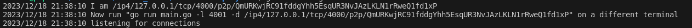
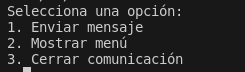
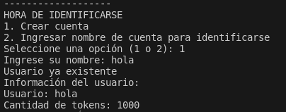
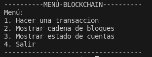
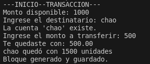
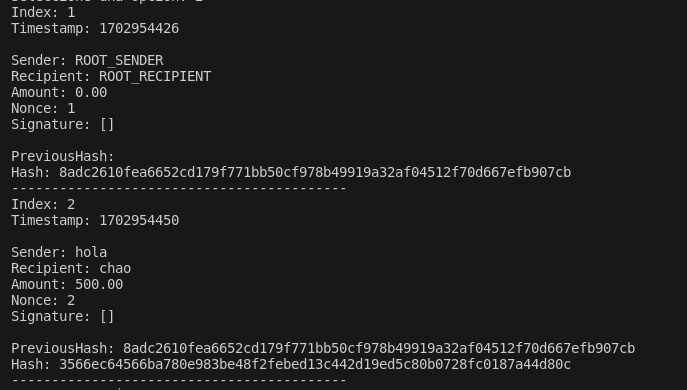
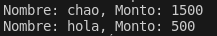

# Proyecto Blockchain: Entregas 

En el repositorio es posible encontrar la entrega final del proyecto semestral. Este contiene la implementación de las distintas funcionalidades que fueron solicitadas.


## Integrantes

- Gastón Donoso
- Claudio López
- Rómulo Otárola
- Pablo Sáez
## Funcionalidades

- **Realizar una transacción entre dos usuarios**: Cada una de estas puede ser realizada por dos usuario, Bob y Alice, los cuales se eligen al momento de hacer una transacción, donde se deberá especificar un monto a transferir.
- **Mostrar cadena de bloques**: En esta opción se puede mostrar la opción asociada a cada bloque, de manera secuencial.

- **Mostrar el estado de cuentas**


## Dependencias
Para poder iniciar el programa, se debe ingresar el siguiente comando en la carpeta raiz del proyecto para crear un nuevo módulo:
```bash
go mod init blockchain-proyecto
```
De esta manera se hace un seguimiento de las dependencias que posea el programa.

Luego se ingresa el siguiente comando para instalar las dependencias:

```bash
go mod tidy
```

## Entrega N°3

La entrega N°3 se encuentra en el siguiente enlace:
https://docs.google.com/document/d/1ehaANi88cDup7hd3SFKD74bSHb3FSTziJYamszunYWc/edit?usp=sharing

## Entrega Final

Este programa tiene un enfoque monetario, con el cuál se busca solucionar el problema del doble gasto.
En este se realizan transacciones entre dos usuarios "Bob" y "Alice", los cuales intercambian tokens entre sí.

## Instrucciones de uso

__*_Para realizar intercambios entre dos usuarios, se deben tener dos instancias distintas, ejecutándose en paralelo. Es decir, cada una de estas deben estar en carpetas distintas.___

Para ejecutar el código se debe utilizar el comando:

```bash
go run main.go -l 4000
```
Este comando se encarga de ejecutar el programa en el puerto 4000 (puede ser cualquier puerto que se desee).

Luego de iniciar el programa, se debe ingresar el comando mostrado por la terminal, en la otra terminal que corresponde al otro usuario, como se muestra en la siguiente imagen.


Una vez se tiene el programa ejecutándose en cada una de las terminales, se muestra el siguiente menú: 



Las opciones corresponden:


- Enviar mensaje: Se envía un mensaje al otro participante de la red, siendo este un string.
- Mostrar menú: Esta opción muestra un menú de opciones, que permite crear una cuenta o ingresar a una cuenta ya existente, donde posteriormente se muestra el menú para realizar transacciones.
- Cerrar comunicación: Termina la comunicación entre las dos instancias.

Posterior a esto, en una primera instancia, se debe elegir la opción 2. En la siguiente imagen se muestran las opciones de inicio de sesión:
 


En este caso se muestra la opción crear usuario, donde se ingresa uno que ya existe, por lo que se procede a mostrar la información de este (Usuario y cantidad de tokens).
Por defecto todos los usuario tienen 1000 tokens

Posteriormente se muestra el un nuevo menú, con las distintas opciones que se pueden realizar en la cadena.



__Todo esto tambien debe realizarse en el segundo usuario__ 

## Hacer una transacción

Al elegir esta opción, 

Luego se debe elegir el destinatario, en este caso, "hola" le envia a "chao" un monto de 500 tokens.




En la imagen anterior se muestran el curso de acción al ingresar los tokens a enviar, donde además se muestran los tokens restantes del usuario "hola" y los que recibe "chao"

## Mostrar cadena de bloques

En la siguiente imagen, se muestra la cadena de bloques con las transacciones.



## Mostrar estado de cuentas

A continuacion, se muestran los estados de cuentas almacenados en la base de datos con los saldos


